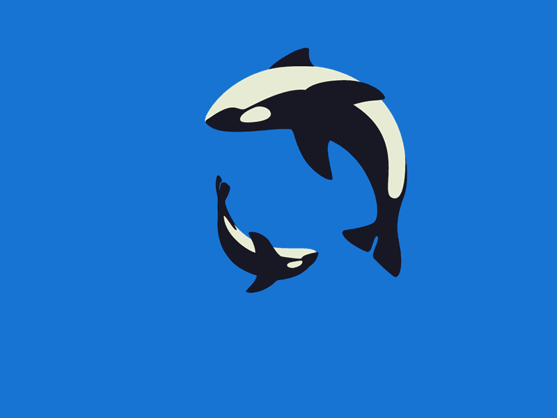
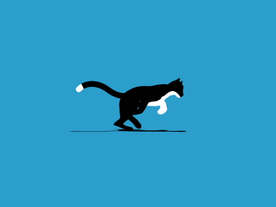
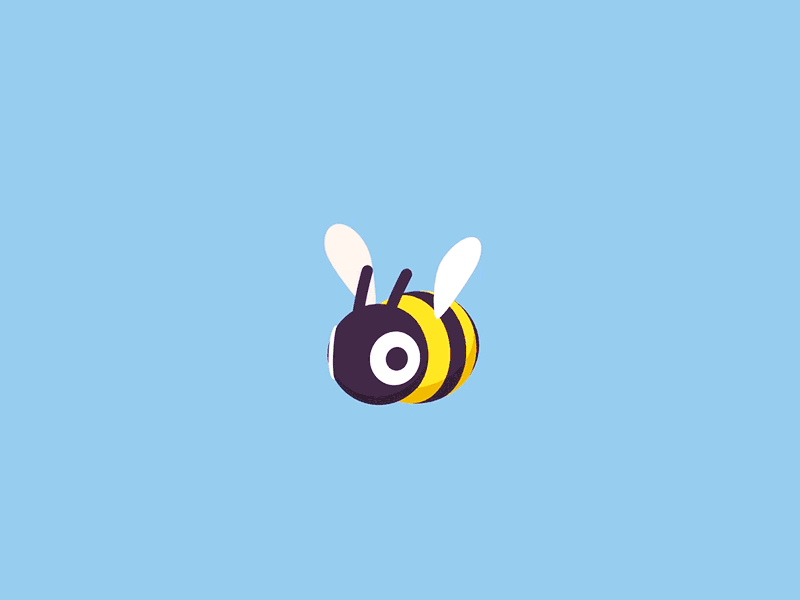

    <!--TITLE-->
    
    <!--SUBTITLE-->
    
    <!--LINE-->
    

<!-------------------------BADGES------------------------->

    
    
    
    
    
     
    
    
    
    
    
     
    
    
    
    
     
    <!--LINE-->
    

<!-------------------------STATS CARDS------------------------->

    <!--TOP LANGUAGES BY REPO-->
    
    <!--STATS-->
    
     
    <!--COMMITS-->
    
    <!--ORCA_GIF-->
    
     
    <!--CAT_GIF-->
    
    <!--TOP LANGUAGES BY COMMIT-->
    
     
    <!--CURRENT STREAK-->
    
    <!--BEE_GIF-->
    
     
    <!--GRAPHIC-->
    
    <!--LINE-->
    

