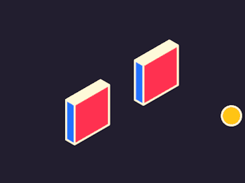

    <!--LINE-->
    
    <!--LANGUAGES, IDES AND TOOLS-->
    

        
        
        
        
        
    

    

        
        
        
        
        
    

    <!--LINE-->
    
    

        <!--GIF-->
        
        <!--TOP LANGUAGES-->
        
        <!--GIF-->
        
         
        <!--STATS-->
        
        <!--TOP LANGUAGES COMMIT-->
        
         
        <!--TOP LANGUAGES REPO-->
        
        <!--COMMIT UTC-->
        
         
        <!--GRAPHIC-->
        
         
        <!--STREAK-->
        
        <!--GIF-->
        
    

    <!--LINE-->
    

<!--
SELECIONAR VÁRIOS ATRIBUTOS CTRL + D

-->